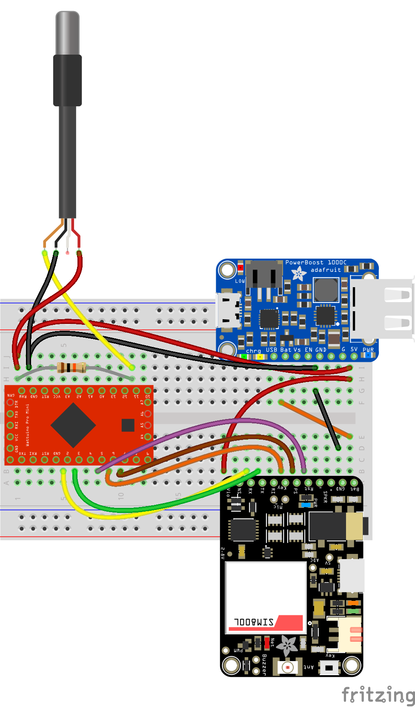

# GSM-Temperature-senseBox
A battery operated cellular senseBox to measure water temperature

## Hardware
You will need the following hardware:
- Wattuino Pro Mini
- [Adafruit FONA](https://learn.adafruit.com/adafruit-fona-mini-gsm-gprs-cellular-phone-module/overview)
- DS18B20 Temperature Sensor
- LiPo Battery

## Installation
### Register a new senseBox
Please create a custom senseBox on https://opensensemap.org and add three sensors:
- Temperature (°C)
- Battery Level (%)
- RSSI (dBm)

### Configuration of the code
Edit `CONFIG.h.example` and change insert your SIM PIN Code, senseBox ID, sensor IDs and your APN Provider. Save the file as `CONFIG.h`.

### Upload
Connect and configure your Arduino Pro Mini with an FTDI adapter or over an Arduino Uno to your computer.
You should now be able to upload the code and see logs on the console.
